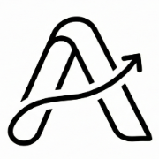
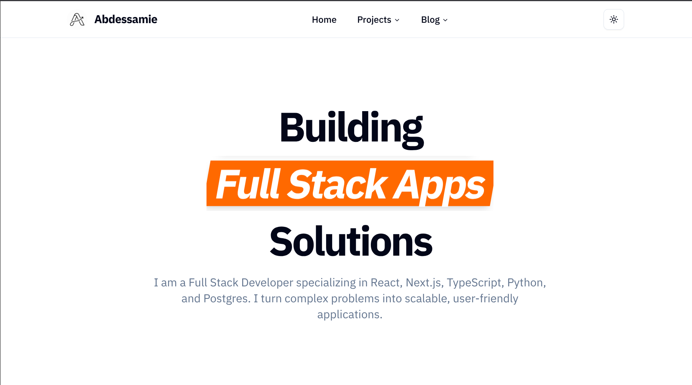
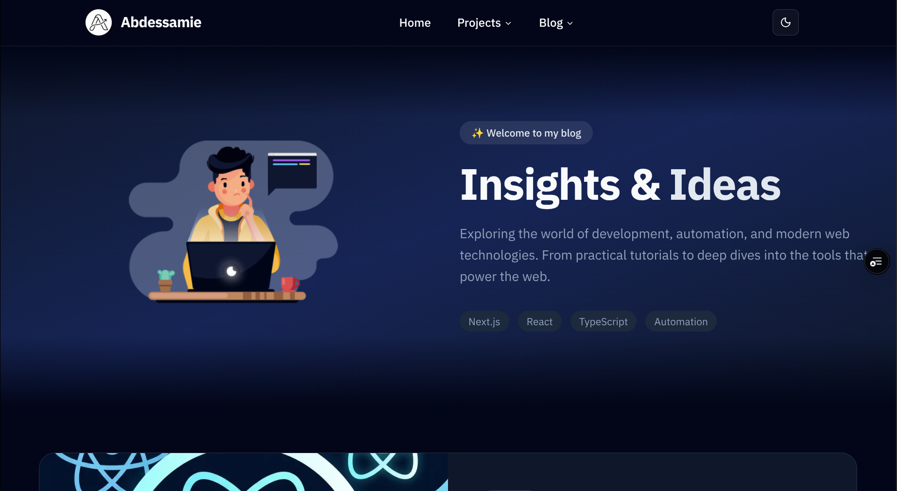
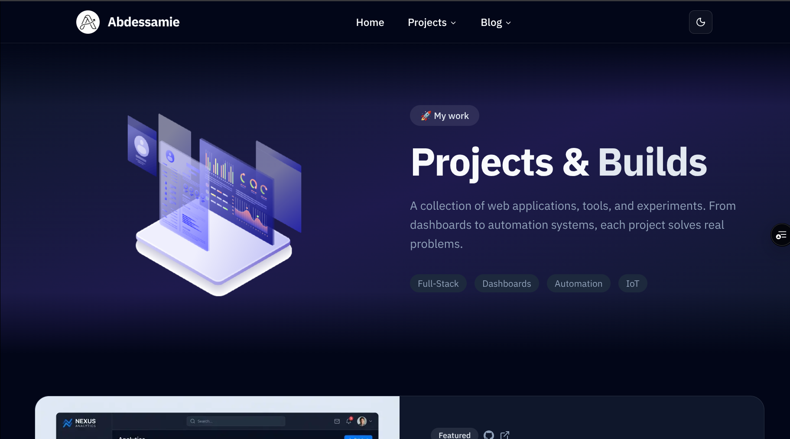

<div align="center">
  

  <h1 align="center">Next.js 16 Portfolio & Blog</h1>

  <p align="center">
    A high-performance, developer-focused portfolio and blog built with the bleeding edge of the React ecosystem.
    <br />
    <br />
    <a href="https://nextjs-portfolio-blog-one.vercel.app/">
      
    </a>
    <br />
    <br />
    <a href="https://github.com/Abdssamie/nextjs-portfolio-blog/issues">Report Bug</a>
    ·
    <a href="https://github.com/Abdssamie/nextjs-portfolio-blog/issues">Request Feature</a>
  </p>

  <p align="center">
    <a href="https://nextjs.org">
      
    </a>
    <a href="https://react.dev">
      
    </a>
    <a href="https://www.typescriptlang.org/">
      
    </a>
    <a href="https://tailwindcss.com">
      
    </a>
  </p>
</div>

<br />



## 🚀 About The Project

This project is a modern, production-ready portfolio and blog engine designed to showcase technical skills and content with exceptional performance. It leverages the latest features of Next.js 16 (App Router, Server Actions) and React 19 to deliver a seamless user experience.

Key features include:
*   **Dynamic MDX Blog Engine**: Write content in Markdown/MDX with fully custom components and syntax highlighting.
*   **High Performance**: Optimized with `next/image`, zero-CLS layout shift protections, and efficient scroll handling.
*   **SEO Optimized**: Dynamic metadata, OpenGraph images, sitemap generation, and JSON-LD structured data.
*   **Beautiful UI/UX**: Dark mode support, glassmorphism effects, and smooth framer-motion-like animations using Tailwind.
*   **Robust Engineering**: Strict TypeScript, ESLint configuration, and CI/CD pipelines ensuring code quality.

### 📸 Project Previews

| Blog Section | Projects Grid |
|:---:|:---:|
|  |  |

## 🛠️ Tech Stack

*   **Framework**: [Next.js 16](https://nextjs.org/) (App Router)
*   **Library**: [React 19](https://react.dev/)
*   **Language**: [TypeScript](https://www.typescriptlang.org/)
*   **Styling**: [Tailwind CSS](https://tailwindcss.com/) & [Lucide Icons](https://lucide.dev/)
*   **Content**: MDX with [next-mdx-remote](https://github.com/hashicorp/next-mdx-remote)
*   **Animation**: CSS Animations & custom hooks
*   **CI/CD**: GitHub Actions

## 🚦 Getting Started

To run this project locally, follow these simple steps.

### Prerequisites

*   Node.js 18+ 
*   pnpm (recommended) or npm/yarn

### Installation

1.  Clone the repo
    ```sh
    git clone https://github.com/Abdssamie/nextjs-portfolio-blog.git
    ```
2.  Install packages
    ```sh
    pnpm install
    ```
3.  Start the development server
    ```sh
    pnpm dev
    ```

## 🤝 Contributing

Contributions are what make the open source community such an amazing place to learn, inspire, and create. Any contributions you make are **greatly appreciated**.

1.  Fork the Project
2.  Create your Feature Branch (`git checkout -b feature/AmazingFeature`)
3.  Commit your Changes (`git commit -m 'Add some AmazingFeature'`)
4.  Push to the Branch (`git push origin feature/AmazingFeature`)
5.  Open a Pull Request

## 👤 Contact

**Abdessamie**

*   Email: [abdessamie.elmoubarki@gmail.com](mailto:abdessamie.elmoubarki@gmail.com)
*   GitHub: [@Abdssamie](https://github.com/Abdssamie)
*   LinkedIn: [Profile](https://www.linkedin.com/in/abdessamaie-el-moubarki-406296310/)

Code built with ❤️ using Next.js & TypeScript.
